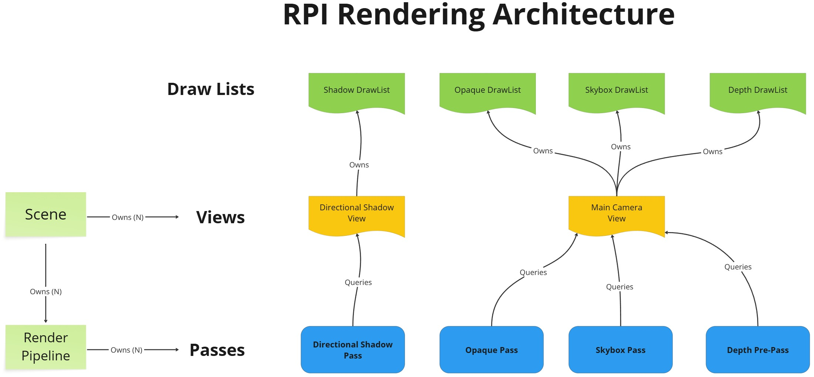
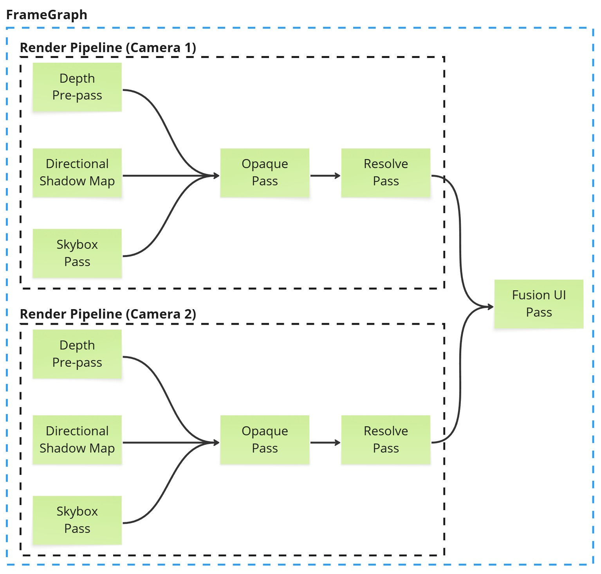

# 1. Intro

CrystalEngine is a from-scratch, cross-platform 3D game engine in C++20 with Vulkan and Metal RHI backends. Windows is the primary target, with macOS (Apple Silicon / Metal) and Linux as secondary.

### How to build the engine: See [Build.md](./Build.md)

### Design Philosophy:
Custom built systems from scratch, tightly integrated components. I own the whole stack. Less reliance on third-party libraries.

### Features Overview:
- 🔧 **Cross-platform game engine** supporting Windows, macOS (Apple Silicon / Metal), and Linux.
- 🛠️ **CMake** build system with modular engine architecture.
- 🎨 **Fusion UI framework** — a fully custom-built, **DPI-aware**, cross-platform **declarative** C++ UI system, used for both runtime and editor UIs.
- 🧩 **Advanced docking system** — Fusion supports nested vertical/horizontal splits and tabbed views.
- 🎨 **Fusion** supports features like drawing images, gradients, custom transformations, data binding, and many more.
- 🛠️ **Directed Acyclic FrameGraph-based GPU scheduler** with automatic resource tracking and dependencies.
- 🖼️ **Forward+** render pipeline with CubeMap Image-based lighting.
- 💡 **HLSL shader authoring** for Vulkan and Metal backends.
- 📦 Multi-threaded **asset processing pipeline** with binary asset generation and automatic dependency tracking.
- 🔍 Custom-built automatic **C++ reflection**, binary **serialization**, and **runtime object system** — no third-party metadata libraries.
- 🔧 Editor & Tooling built using the same Fusion UI framework.

### Known Issues / Incomplete stuff
- No point/spot light shadows.
- MetalRHI backend was just introduced and is unstable.
- Standalone build mode is used just as a TestBed for now.
- Physics support is also unstable.
- Fusion UI is really sluggish with complex UI panels on slow GPUs.
- FrameGraph destroys and reallocates all resources when recompiled. 
- Need to implement a FrameGraph ResourcePool to reuse resources, and also have FrameGraph optimally recompile every frame.
- No play mode in the editor.
- No console logging in editor.

---
# 2. Architecture Overview

### The engine is divided into different modules (DLLs).

Multiple modules are grouped together in a **layer** based on their domain.

#### Two Build Modes (via CMake): Standalone build (left) and Editor build (right)


 
### Core Layer modules
- **Core**: RTTI, reflection, serialization, object system, math, containers, etc.
- **CoreApplication**: OS Windowing management, input, OS abstractions, SDL abstractions, etc.
- **CoreMedia**: Raw image handling, png/jpeg encoding/decoding, BC1-7 image compression, etc.
- **CoreMesh**: Loading raw mesh data from FBX/gltf assets
- **CoreShader**: Shader compiler and reflection. Uses DxCompiler, spirv_reflect, spirv_cross.
- **CorePhysics**: Jolt physics integration.

#### The rendering stack:
* CoreRHI: Graphics API abstraction layer. Low level GPU operations, FrameGraph, DrawList, etc.
    * VulkanRHI: Windows and Linux
    * MetalRHI: MacOS
* CoreRPI: Render Pipeline Interface. Provides a render pipeline architecture, Scenes, Views, Shaders, Materials to the engine. Think of this as the "Renderer" of the engine. 
* **FusionCore**: Widgets library used to build GUI applications with declarative syntax.
* **Fusion**: Adds more high level Fusion widgets like TreeView, ListView and more.

### Engine Layer modules

Engine layer modules are at high level of the engine.

* **Engine**: The main module that contains the high level game engine systems, game framework, etc.
* **GameEngine**: Only for standalone builds. Runtime implementation of System module.

### EditorCore Layer modules

* **EditorCore**: Implements asset processing logic, thumbnail system, re-usable editor widgets, and serves as the foundation of the editor & host tools.

### EditorEngine Layer modules

* **EditorEngine**: Host/editor implementation of the Engine module.
* **CrystalEditor**: Contains all the editor windows, GUIs

### Tools
All tools are CLI executables:
* AutoRTTI: Parses header files and generates reflection info in .rtti.h headers.
* AssetProcessor: Used to process engine and editor assets at **build** time.
* ResourceCompiler: Used to embed files as binary data in C++ programs.

---
# 3. Rendering Stack

## RHI (Render Hardware Interface)

CoreRHI is the Graphics API abstraction layer. It defines the contract (DynamicRHI) that both VulkanRHI and MetalRHI implement. It also defines the abstract FrameGraph related classes.

### Resource abstractions:
- RHI::Buffer
- RHI::Texture, RHI::TextureView
- RHI::SwapChain

### Resource binding model:
- **RHI::ShaderResourceGroup** (SRG): Maps to a VkDescriptorSet in Vulkan, and an Argument Buffer in Metal.
- You can only bind an entire ShaderResourceGroup at once.
- To change an individual binding inside a SRG, this is how you'd do it:
```cpp
RHI::Buffer* viewConstantBuffer = ...;
shaderResourceGroup->Bind("_PerViewData", viewConstantBuffer);
shaderResourceGroup->FlushBindings(); // bindings won't be updated without the FlushBindings call.
```
- There are 7 different SRG Types based on **binding frequency** (aka Descriptor Set Number) from 0-6:
    - PerScene = Descriptor Set 0
    - PerView
    - PerPass
    - PerSubPass
    - PerMaterial
    - PerObject
    - PerDraw = Descriptor Set 6

### Synchronization model:
- RHI::Fence: A monotonically increasing uint64_t counter used for both CPU-GPU and GPU-GPU synchronization.
    - VulkanRHI implements this via a Timeline Semaphore
    - MetalRHI implements this via MTLSharedEvent
- RHI::CommandList::ResourceBarrier(): Maps to Pipeline Barriers in Vulkan (both execution and memory barriers) and also applies Image Layout Transitions.

### DrawListTag, DrawItems, DrawPackets, DrawLists

These four concepts form the engine's draw call submission data structures — the path from "a mesh exists in the scene" to "a GPU draw call is recorded."

#### DrawListTag
A `DrawListTag` is a lightweight handle that identifies a **render pass category** — e.g., Opaque, Transparent, Shadow, Depth, etc. Tags are registered by name at startup via `DrawListTagRegistry`. A `DrawListMask` (bitset) represents a set of active tags, used to filter which draw items a given pass cares about.

#### DrawItem
A `DrawItem` is **one draw call for one mesh in one pass**. It contains everything needed to record that draw call:
- VertexBufferViews, IndexBufferView
- Draw Call Arguments: vertex count, index count, etc.
- Either the pipelineState, or the GraphicsPipelineCollection (to handle different MSAA, color formats, etc.).
- Shader Resource Groups to bind.
- etc.

#### DrawPacket
A `DrawPacket` is a **collection of DrawItems for a single mesh** — one item per pass the mesh participates in.

#### DrawList
A `DrawList` is a flat collection if `DrawItem`s all sharing the same `DrawListTag`, i.e. they all belong to the same pass.

We create and maintain a `DrawList` per each `DrawListTag`, called `DrawListsByTag`, so they can all be iterated separately for separate render passes.

### Frame Graph:
An DAG-based GPU work scheduler:
- Build Phase:       FrameGraphBuilder  → declares scopes, attachments, producers/consumers
- Compile Phase:     FrameGraphCompiler → validates dependencies, compiles pipeline barriers, allocates transient resources, etc.
- Execute Phase:     FrameGraphExecuter → records and submits command lists to appropriate queues.

This gives automatic resource lifetime management, automatic barriers/transitions, and correct multi-pass ordering — without the programmer manually managing any of that.

Here is a sample code showing how to build a Frame Graph:

```cpp
scheduler->BeginFrameGraph();
{
    RHI::FrameAttachmentDatabase& attachmentDatabase = scheduler->GetAttachmentDatabase();

	// 1. Emplace Attachments

    attachmentDatabase.EmplaceFrameAttachment(kColorAttachmentId, swapChain);

    attachmentDatabase.EmplaceFrameAttachment(kDepthAttachmentId, RHI::ImageDescriptor{
        .name = "DepthTexture",
        .width = swapChain->GetWidth(),
        .height = swapChain->GetHeight(),
        .depth = 1,
        .dimension = Dimension::Dim2D,
        .format = gDynamicRHI->GetAvailableDepthOnlyFormats()[0],
        .mipLevels = 1,
        .sampleCount = 1,
        .arrayLayers = 1,
        .bindFlags = TextureBindFlags::Depth,
        .defaultHeapType = MemoryHeapType::Default
    });

    // 2. Create Scopes

    // Each "Scope" is just one render/compute/transform pass. 
    scheduler->BeginScope(kDepthPrePassId);
    {
        RHI::ImageScopeAttachmentDescriptor depthAttachment{};
        depthAttachment.attachmentId = kDepthAttachmentId;
        depthAttachment.loadStoreAction.clearValueDepth = 1.0f;
        depthAttachment.loadStoreAction.loadAction = RHI::AttachmentLoadAction::Clear;
        depthAttachment.loadStoreAction.storeAction = RHI::AttachmentStoreAction::Store;
        depthAttachment.multisampleState.sampleCount = 1;
        scheduler->UseAttachment(depthAttachment, RHI::ScopeAttachmentUsage::DepthStencil, RHI::ScopeAttachmentAccess::ReadWrite);
        
       	scheduler->UseShaderResourceGroup(perViewSrg);
					
        scheduler->UsePipeline(depthPipeline);
    }
    scheduler->EndScope();

    scheduler->BeginScope(kColorPassId);
    {
        RHI::ImageScopeAttachmentDescriptor swapChainAttachment{};
        swapChainAttachment.attachmentId = kColorAttachmentId;
        swapChainAttachment.loadStoreAction.clearValue = Vec4(0, 0, 0.2f, 1);
        swapChainAttachment.loadStoreAction.loadAction = RHI::AttachmentLoadAction::Clear;
        swapChainAttachment.loadStoreAction.storeAction = RHI::AttachmentStoreAction::Store;
        scheduler->UseAttachment(swapChainAttachment, RHI::ScopeAttachmentUsage::Color, RHI::ScopeAttachmentAccess::ReadWrite);

					RHI::ImageScopeAttachmentDescriptor depthAttachment{};
					depthAttachment.attachmentId = kDepthAttachmentId;
					depthAttachment.loadStoreAction.loadAction = RHI::AttachmentLoadAction::Load;
					depthAttachment.loadStoreAction.storeAction = RHI::AttachmentStoreAction::Store;
        scheduler->UseAttachment(depthAttachment, ScopeAttachmentUsage::DepthStencil, ScopeAttachmentAccess::Read);

        scheduler->UseShaderResourceGroup(perViewSrg);

        scheduler->UsePipeline(colorPipeline);

        scheduler->PresentSwapChain(swapChain);
    }
    scheduler->EndScope();
scheduler->EndFrameGraph()
```

## RPI (Render Pipeline Interface)

CoreRPI sits above CoreRHI and is the actual **"renderer"**. 

It's where game-world concepts (meshes, lights, cameras, materials) get translated into RHI draw calls. 

It doesn't know about Actors or Components — that's the Engine layer's job. 

RPI only knows about Scenes, Views, Feature Processors, Passes, and Materials.



### Scene
- **Scene** owns Feature Processors, Views, and Render Pipeline instances.
- Also holds scene level GPU data, such as lighting buffer, IBL textures, SRG_PerScene, etc.

### View
- **View** represents one camera perspective, and is not limited to just Cameras.
- Ex: A DirectionalLight that casts a shadow also creates a view called "ShadowView".
- So a view is anything that renders the scene in any form: Shadow casting lights, reflection probes, etc.

### FeatureProcessor
- A `FeatureProcessor` is a rendering plugin owned by a `Scene`. 
- Each one is responsible for one rendering domain — static meshes, directional lights, local lights, etc. 
- Feature Processors know nothing about Actors or Components; they are a purely RPI concept.
- The two lifecycle methods every `FeatureProcessor` implements:
    - Simulate() — update CPU-side state (transforms, visibility)
    - Render() — enqueue DrawPackets into View's DrawListContext

The Engine layer (Components) talks to Feature Processors via opaque handles:

  ```cpp
  // In a Component's Init stage:
  auto* fp = scene->GetFeatureProcessor<StaticMeshFeatureProcessor>();
  meshHandle = fp->AcquireMesh({ .model = model }, material);

  // Each frame, update the handle directly:
  meshHandle->localToWorldTransform = GetWorldTransform();

  // In DeInit stage:
  fp->ReleaseMesh(meshHandle);
```

Built-in Feature Processors:
- StaticMeshFeatureProcessor
- DirectionalLightFeatureProcessor
- LocalLightFeatureProcessor: For point and spot lights.

### Materials and Shaders

- **Shader**: wraps one or more ShaderVariants. Each variant is a compiled HLSL program for a specific configuration. A Shader has an associated DrawListTag — it declares which pass it belongs to
- **ShaderCollection**: a Material can have multiple Shaders (e.g., one for Opaque, one for Shadow). The collection maps DrawListTag → Shader
- **Material**: holds a ShaderCollection + a ShaderResourceGroup for GPU-side properties (textures, floats, colors). FlushProperties() uploads CPU values to GPU
- **MeshDrawPacket**: the bridge — given a ModelLod, Material, and object SRG, builds an RHI::DrawPacket with one DrawItem per shader in the collection, each tagged with the correct DrawListTag

### RenderPipeline

Frame Graph Vs RenderPipeline:



### RPI Frame Loop


```
  RPISystem::SimulationTick:
    Scene::Simulate()
      └─ FeatureProcessor::Simulate() × N   ← update transforms, visibility

  RPISystem::RenderTick:
    Scene::PrepareRender()
      └─ Update View SRGs (camera matrices, resolution)
      └─ Update scene lighting buffer
    Scene::SubmitDrawPackets()
      └─ FeatureProcessor::Render() × N     ← enqueue DrawPackets into View's DrawListContext
    DrawListContext::Finalize()             ← merge thread-local lists
    RenderPipeline → PassTree
      └─ Pass::ProduceScopes()              ← feed Frame Graph
      └─ Passes consume DrawLists → CommandList
```

---
# 4. Reflection, RTTI & Serialization

The entire reflection, RTTI and serialization system is custom built from ground up.

Here's the high level overview of how it works:
- You annotate types with macros: CLASS(), FIELD(), FUNCTION(), ENUM().
- The AutoRTTI host tool scans source files at build time and generates .rtti.h files.
- These generated headers contain ClassType metadata, serialization glue, and property tables.
- An object by itself cannot be serialized directly to disk. A `CE::Bundle`, a collection of `CE::Object`s, is the one that can be serialized/deserialized to disk. See [BundleFileFormatSpec3](./BundleFileFormatSpec3.md) for Bundle file format spec.
- The DetailsView Property Editor is driven by reflection.

Here is an example of how to reflect fields and functions in a class:

```cpp
CLASS() // marks a class as reflectable
class MyActor : public Actor {
    CE_CLASS(MyActor, Actor)     // required in class body — sets up inheritance chain
public:

    FUNCTION()
    void SomeFunction(const String& str);

    FIELD(EditAnywhere, Category = "Movement") // Makes the field appear on DetaisView panel.
    float speed = 5.0f;

    FIELD(NonSerialized)         // visible in editor but never saved
    bool debugFlag = false;

    FUNCTION()
    void Jump();
};

#include "MyActor.rtti.h" // The generated rtti header
```

And here is an example of how to use RTTI on the MyActor class to invoke a reflected function.

```cpp
ClassType* clazz = GetStaticClass<MyActor>();
FunctionType* function = clazz->FindFunctionWithName("SomeFunction");

MyActor* myActor = CreateObject<MyActor>();
function->Invoke(myActor, { "TheStringArgument" }); // This is same as: myActor->SomeFunction("TheStringArgument");
```

For more details on how reflection and RTTI work, please check out this article:

[https://neilmewada.com/custom-c-reflection-serialization-in-crystal-engine/](https://neilmewada.com/custom-c-reflection-serialization-in-crystal-engine/)

# 5. Game Framework

The Engine layer sits above RPI and CoreRHI. It knows nothing about GPU operations — it translates game concepts (actors, components, transforms) into RPI calls.

### Actor

The base game object. An Actor has one root SceneComponent (its transform anchor) and any number of additional components. Key lifecycle:

```cpp
OnBeginPlay()         // called once when scene starts playing
Tick(f32 delta)       // called every frame
OnEnabled()           // called when actor is enabled
OnDisabled()          // called when actor is disabled
```

### ActorComponent

Non-spatial component — behaviour without a position. Same lifecycle as Actor (OnBeginPlay, Tick, OnEnabled, OnDisabled). Ticking is opt-in: SetCanTick(true).

### SceneComponent

Spatial component — has localPosition, localEulerAngles, localScale. These compose into a world-space transform matrix. Components form a hierarchy via
SetupAttachment():
```cpp
// Inside an Actor constructor:
SceneComponent* root = CreateDefaultSubobject<SceneComponent>("Root");
SetRootComponent(root);

StaticMeshComponent* mesh = CreateDefaultSubobject<StaticMeshComponent>("Mesh");
mesh->SetupAttachment(root);  // child of root in transform tree
```
Note: SetupAttachment() is the SceneComponent transform hierarchy. Actor parent-child (AttachActor()) is a separate but related concept.

### Object Creation

Two patterns, used in different contexts:
```cpp
// Global factory — use when creating objects from outside (e.g. in a system or tool)
Actor* actor = CreateObject<Actor>(scene, "MyActor");

// Protected factory — use inside a class constructor to create owned subobjects
StaticMeshComponent* mesh = CreateDefaultSubobject<StaticMeshComponent>("Mesh");
```

### Scene (Engine Layer)

The Engine-layer CE::Scene is different from RPI::Scene. It owns:
- All root Actors
- An RPI::Scene*
- A PhysicsScene (Jolt world)
- A CameraComponent* main camera reference
- A component lookup table by type for fast iteration (IterateAllComponents<T>())

The bridge to rendering: CE::Scene owns the RPI::Scene, and RendererSubsystem drives both each frame.

